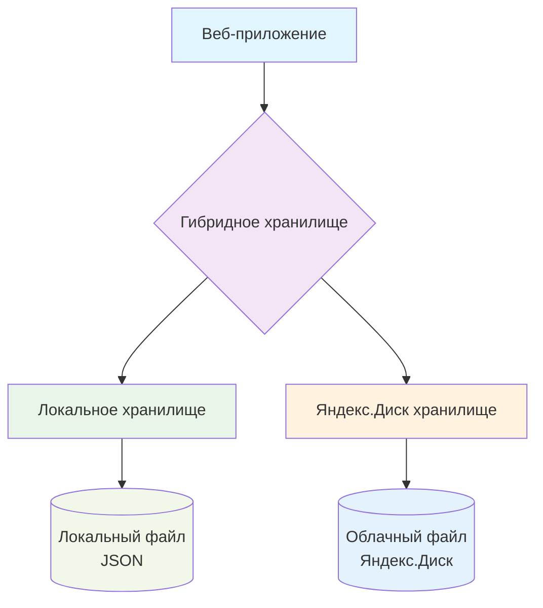

# Гибридное хранилище

Гибридное хранилище - это система, которая сочетает локальное хранение данных с облачной синхронизацией через Яндекс.Диск.

## Архитектура



___
## Работа гибридного хранилища

```text
┌─────────────────┐    Синхронизация    ┌─────────────────┐
│                 │◄───────────────────►│                 │
│ Локальный файл  │                     │  Яндекс.Диск    │
│ (app/data/      │                     │  (облако)       │
│ test_cards.json)│                     │                 │
│                 │                     │                 │
└─────────────────┘                     └─────────────────┘
         │                                       │
         ▼                                       ▼
┌─────────────────┐                     ┌─────────────────┐
│ Быстрый доступ  │                     │ Доступ с любого │
│   без интернета │                     │    устройства   │
└─────────────────┘                     └─────────────────┘
```

___
## Принцип работы

**Принцип работы:**

1. При загрузке приложение сначала проверяет Яндекс.Диск
2. Если нет соединения - использует локальную копию
3. При сохранении данные записываются и локально, и в облако
4. При конфликтах используется версия из облака

### Загрузка данных

```python
def load_data():
    if mode == 'local':
        return load_from_local()
    elif mode == 'yandex':
        data = load_from_yandex()
        save_to_local(data)  # Кэширование
        return data
    elif mode == 'hybrid':
        try:
            data = load_from_yandex()
            save_to_local(data)
            return data
        except:
            return load_from_local()  # Fallback
```

### Сохранение данных

```python
def save_data(data):
    save_to_local(data)  # Всегда сохраняем локально
    
    if mode in ['yandex', 'hybrid']:
        try:
            save_to_yandex(data)
        except:
            log_error("Не удалось синхронизировать с Яндекс.Диском")
```

___
## Режимы работы

Приложение поддерживает три режима работы:

**1. Локальный режим (STORAGE_MODE=local)**<br>
- Данные хранятся только локально<br>
- Быстрая работа без интернета<br>
- Без синхронизации между устройствами<br>

**Настройка:**

```env
STORAGE_MODE=local
```

**Характеристики:**<br>
✅ Быстрая работа без интернета<br>
✅ Простая настройка<br>
❌ Нет синхронизации<br>
❌ Нет резервного копирования<br>

**Использовать когда:**<br>
- Работаете только на одном компьютере<br>
- Нет доступа к Яндекс.Диску<br>
- Не требуется синхронизация<br>

**2. Режим Яндекс.Диск (STORAGE_MODE=yandex)**<br>
- Данные хранятся только в облаке<br>
- Полная синхронизация между устройствами<br>
- Требуется постоянное интернет-соединение<br>

**Настройка:**

```env
STORAGE_MODE=yandex
YANDEX_DISK_TOKEN=ваш_токен
```

**Характеристики:**<br>
✅ Полная синхронизация<br>
✅ Доступ с любого устройства<br>
❌ Требуется постоянный интернет<br>
❌ Медленнее локального режима<br>

**Использовать когда:**<br>
- Работаете с нескольких устройств<br>
- Нужна синхронизация в реальном времени<br>
- Есть стабильное интернет-соединение<br>

**3. Гибридный режим (рекомендуется) (STORAGE_MODE=hybrid)**<br>
- Локальное хранение + облачная синхронизация<br>
- Быстрая работа с локальным кэшем<br>
- Автоматическая синхронизация при подключении<br>
- Резервное копирование в облако<br>

**Настройка:**

```env
STORAGE_MODE=hybrid
YANDEX_DISK_TOKEN=ваш_токен
```

**Характеристики:**<br>
✅ Быстрая работа с локальным кэшем<br>
✅ Синхронизация при наличии интернета<br>
✅ Отказоустойчивость<br>
✅ Автоматическое резервное копирование<br>

**Использовать когда:**<br>
- Нужна и скорость, и синхронизация<br>
- Работаете в условиях нестабильного интернета<br>
- Хотите иметь локальную копию данных<br>

___
## Синхронизация данных

#### Алгоритм синхронизации

**При запуске:**<br>
- Проверяется версия файла на Яндекс.Диске<br>
- Если версия новее, данные загружаются<br>
- Если локальная версия новее, данные отправляются<br>

**При изменении:**<br>
- Данные сохраняются локально<br>
- Пытается синхронизация с Яндекс.Диском<br>
- При ошибке - данные сохраняются в очередь<br>

**При восстановлении соединения:**<br>
- Проверяется очередь синхронизации<br>
- Выполняется синхронизация отложенных изменений<br>

___
## Разрешение конфликтов

При конфликте версий используется стратегия:

- Берется версия с Яндекс.Диска<br>
- Локальная версия сохраняется как backup<br>
- Пользователь уведомляется о конфликте<br>

___
## Настройка хранилища

Шаг 1: Создание файла данных

```bash
# Проверьте существование файла данных
ls -la app/data/test_cards.json

# Если файла нет, создайте его
echo '{"cards": [], "themes": [], "next_id": 1}' > app/data/test_cards.json
```

Шаг 2: Настройка прав доступа

=== "Linux/Mac"

```bash
chmod 644 app/data/test_cards.json
chmod 755 app/data/
```
=== "Windows"

```powershell
# Проверьте, что у пользователя есть права на чтение/запись
icacls app\data\test_cards.json /grant Users:F
```

Шаг 3: Настройка резервного копирования

```bash
# Создайте скрипт для резервного копирования
cat > backup.sh << 'EOF'
#!/bin/bash
DATE=$(date +%Y%m%d_%H%M%S)
cp app/data/test_cards.json app/data/backup/test_cards_$DATE.json
echo "Backup created: test_cards_$DATE.json"
EOF

chmod +x backup.sh
./backup.sh
```

___
## Мониторинг хранилища

**Страница статуса**<br>
Доступна по адресу: /system/status<br>

**Отображает:**<br>
- Режим хранения<br>
- Статус подключения к Яндекс.Диску<br>
- Количество карточек<br>
- Размер файлов<br>
- Время последней синхронизации<br>

___
## Логирование

Логи хранятся в консоли и содержат:

```log
[2024-01-15 10:30:45] INFO: Загружено 150 карточек из локального файла
[2024-01-15 10:30:46] INFO: Синхронизация с Яндекс.Диском успешна
[2024-01-15 10:30:47] INFO: Сохранено 150 карточек локально
```

___
## Оптимизация производительности

Кэширование

```python
# При загрузке данных используется локальный кэш
# Время жизни кэша: 5 минут
CACHE_TTL = 300  # секунд
```

Ленивая загрузка

```python
# Карточки загружаются порциями
CARDS_PER_PAGE = 20
```

Сжатие данных

```python
# Данные сжимаются перед отправкой в облако
import zlib
compressed_data = zlib.compress(json_data.encode())
```

___
## Безопасность

Шифрование данных

```python
# Для чувствительных данных можно включить шифрование
ENCRYPTION_KEY = os.environ.get('ENCRYPTION_KEY')
if ENCRYPTION_KEY:
    data = encrypt_data(data, ENCRYPTION_KEY)
```

___
### Резервное копирование

Резервное копирование происходит с помощью экспорта в `xlsx`-файл с данными.

Восстановление бэкапа - с помощью импорта `xlsx`-файла с данными.

___
## Устранение неполадок

#### Проблема: Нет соединения с Яндекс.Диском
**Решение:**<br>
- Проверьте токен в .env<br>
- Проверьте интернет-соединение<br>
- Проверьте статус Яндекс.Диска<br>

#### Проблема: Конфликт версий
**Решение:**<br>
- Проверьте страницу статуса<br>
- Используйте последнюю версию из облака<br>
- Восстановите из локального бэкапа при необходимости<br>

#### Проблема: Медленная синхронизация
**Решение:**<br>
- Уменьшите размер файла<br>
- Включите сжатие данных<br>
- Используйте локальный режим при медленном интернете<br>

___
## Миграция данных

**Из локального в облачное хранилище**<br>
1. Убедитесь, что локальные данные актуальны<br>
2. Установите `STORAGE_MODE=yandex`<br>
3. Перезапустите приложение<br>
4. Данные автоматически загрузятся в облако<br>

**Из облачного в локальное хранилище**<br>
1. Установите STORAGE_MODE=local<br>
2. Скопируйте файл из облака локально<br>
3. Перезапустите приложение<br>

___
## Производительность

**Операция**	Локальный	Яндекс.Диск	  Гибридный<br>
**Загрузка**	~10мс	     ~500мс	         ~100мс<br>
**Сохранение**	~20мс	     ~1000мс	     ~50мс<br>
**Поиск**       ~5мс	     ~100мс	         ~10мс<br>
**Фильтрация**	~2мс	     ~50мс	         ~5мс<br>

___
## Рекомендации

- **Для личного использования:** гибридный режим<br>
- **Для работы в команде:** режим Яндекс.Диск<br>
- **Для офлайн-работы:** локальный режим<br>
- **Для больших объемов данных:** локальный режим + периодическая синхронизация<br>

___
