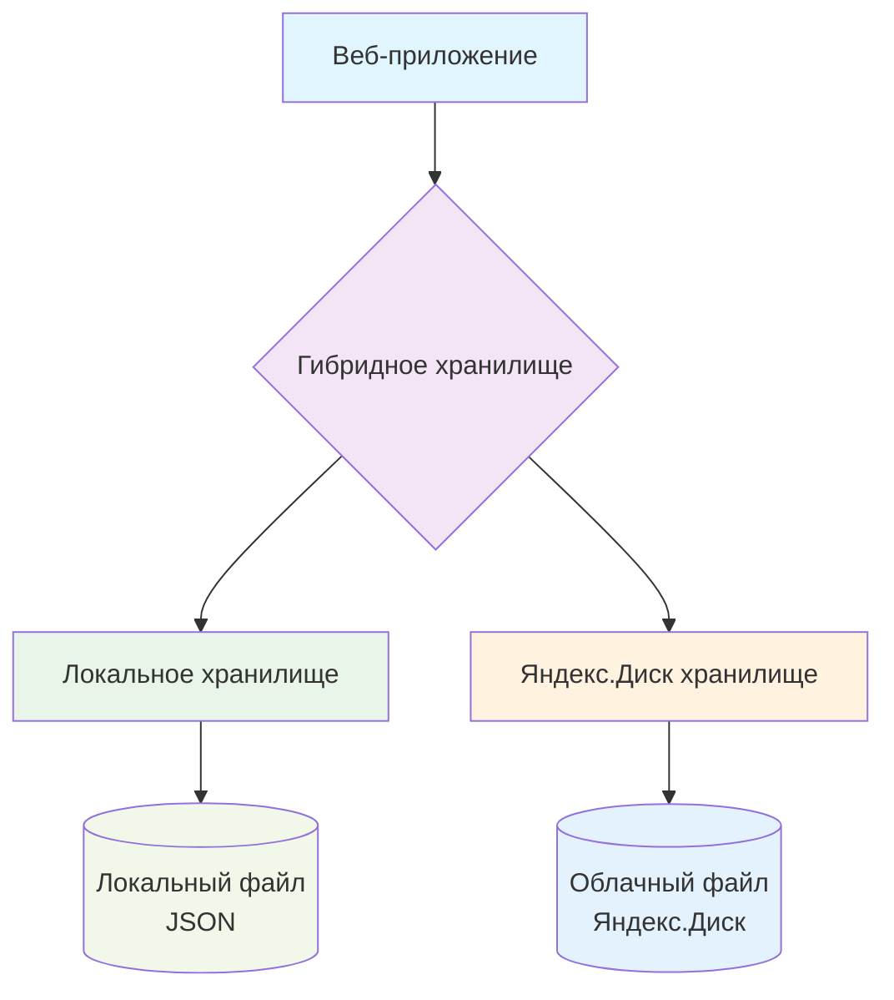

# Гибридное хранилище

Гибридное хранилище - это система, которая сочетает локальное хранение данных с облачной синхронизацией через Яндекс.Диск.

## Архитектура



## Работа гибридного хранилища

┌─────────────────┐    Синхронизация    ┌─────────────────┐
│                 │◄───────────────────►│                 │
│ Локальный файл  │                     │  Яндекс.Диск    │
│ (app/data/      │                     │  (облако)       │
│ test_cards.json)│                     │                 │
│                 │                     │                 │
└─────────────────┘                     └─────────────────┘
         │                                       │
         ▼                                       ▼
┌─────────────────┐                     ┌─────────────────┐
│ Быстрый доступ  │                     │ Доступ с любого │
│   без интернета │                     │    устройства   │
└─────────────────┘                     └─────────────────┘

## Принцип работы

**Принцип работы:**

1. При загрузке приложение сначала проверяет Яндекс.Диск
2. Если нет соединения - использует локальную копию
3. При сохранении данные записываются и локально, и в облако
4. При конфликтах используется версия из облака

### Загрузка данных

```python
def load_data():
    if mode == 'local':
        return load_from_local()
    elif mode == 'yandex':
        data = load_from_yandex()
        save_to_local(data)  # Кэширование
        return data
    elif mode == 'hybrid':
        try:
            data = load_from_yandex()
            save_to_local(data)
            return data
        except:
            return load_from_local()  # Fallback
```

### Сохранение данных

```python
def save_data(data):
    save_to_local(data)  # Всегда сохраняем локально
    
    if mode in ['yandex', 'hybrid']:
        try:
            save_to_yandex(data)
        except:
            log_error("Не удалось синхронизировать с Яндекс.Диском")
```

Режимы работы
1. Локальный режим
Настройка:

env
STORAGE_MODE=local
Характеристики:

✅ Быстрая работа без интернета

✅ Простая настройка

❌ Нет синхронизации

❌ Нет резервного копирования

Использовать когда:

Работаете только на одном компьютере

Нет доступа к Яндекс.Диску

Не требуется синхронизация

2. Режим Яндекс.Диск
Настройка:

env
STORAGE_MODE=yandex
YANDEX_DISK_TOKEN=ваш_токен
Характеристики:

✅ Полная синхронизация

✅ Доступ с любого устройства

❌ Требуется постоянный интернет

❌ Медленнее локального режима

Использовать когда:

Работаете с нескольких устройств

Нужна синхронизация в реальном времени

Есть стабильное интернет-соединение

3. Гибридный режим (рекомендуется)
Настройка:

env
STORAGE_MODE=hybrid
YANDEX_DISK_TOKEN=ваш_токен
Характеристики:

✅ Быстрая работа с локальным кэшем

✅ Синхронизация при наличии интернета

✅ Отказоустойчивость

✅ Автоматическое резервное копирование

Использовать когда:

Нужна и скорость, и синхронизация

Работаете в условиях нестабильного интернета

Хотите иметь локальную копию данных

Синхронизация данных
Алгоритм синхронизации
При запуске:

Проверяется версия файла на Яндекс.Диске

Если версия новее, данные загружаются

Если локальная версия новее, данные отправляются

При изменении:

Данные сохраняются локально

Пытается синхронизация с Яндекс.Диском

При ошибке - данные сохраняются в очередь

При восстановлении соединения:

Проверяется очередь синхронизации

Выполняется синхронизация отложенных изменений

Разрешение конфликтов
При конфликте версий используется стратегия:

Берется версия с Яндекс.Диска

Локальная версия сохраняется как backup

Пользователь уведомляется о конфликте

Настройка хранилища
Шаг 1: Создание файла данных
bash
# Проверьте существование файла данных
ls -la app/data/test_cards.json

# Если файла нет, создайте его
echo '{"cards": [], "themes": [], "next_id": 1}' > app/data/test_cards.json
Шаг 2: Настройка прав доступа
=== "Linux/Mac"

text
```bash
chmod 644 app/data/test_cards.json
chmod 755 app/data/
```
=== "Windows"

text
```powershell
# Проверьте, что у пользователя есть права на чтение/запись
icacls app\data\test_cards.json /grant Users:F
```
Шаг 3: Настройка резервного копирования
bash
# Создайте скрипт для резервного копирования
cat > backup.sh << 'EOF'
#!/bin/bash
DATE=$(date +%Y%m%d_%H%M%S)
cp app/data/test_cards.json app/data/backup/test_cards_$DATE.json
echo "Backup created: test_cards_$DATE.json"
EOF

chmod +x backup.sh
./backup.sh
Мониторинг хранилища
Страница статуса
Доступна по адресу: /system/status

Отображает:

Режим хранения

Статус подключения к Яндекс.Диску

Количество карточек

Размер файлов

Время последней синхронизации

Логирование
Логи хранятся в консоли и содержат:

log
[2024-01-15 10:30:45] INFO: Загружено 150 карточек из локального файла
[2024-01-15 10:30:46] INFO: Синхронизация с Яндекс.Диском успешна
[2024-01-15 10:30:47] INFO: Сохранено 150 карточек локально
Оптимизация производительности
Кэширование
python
# При загрузке данных используется локальный кэш
# Время жизни кэша: 5 минут
CACHE_TTL = 300  # секунд
Ленивая загрузка
python
# Карточки загружаются порциями
CARDS_PER_PAGE = 20
Сжатие данных
python
# Данные сжимаются перед отправкой в облако
import zlib
compressed_data = zlib.compress(json_data.encode())
Безопасность
Шифрование данных
python
# Для чувствительных данных можно включить шифрование
ENCRYPTION_KEY = os.environ.get('ENCRYPTION_KEY')
if ENCRYPTION_KEY:
    data = encrypt_data(data, ENCRYPTION_KEY)
Резервное копирование
yaml
Рекомендуемая стратегия:
  - Ежедневные инкрементные бэкапы
  - Еженедельные полные бэкапы
  - Хранение бэкапов 30 дней
Устранение неполадок
Проблема: Нет соединения с Яндекс.Диском
Решение:

Проверьте токен в .env

Проверьте интернет-соединение

Проверьте статус Яндекс.Диска

Проблема: Конфликт версий
Решение:

Проверьте страницу статуса

Используйте последнюю версию из облака

Восстановите из локального бэкапа при необходимости

Проблема: Медленная синхронизация
Решение:

Уменьшите размер файла

Включите сжатие данных

Используйте локальный режим при медленном интернете

Миграция данных
Из локального в облачное хранилище
bash
# 1. Убедитесь, что локальные данные актуальны
# 2. Установите STORAGE_MODE=yandex
# 3. Перезапустите приложение
# 4. Данные автоматически загрузятся в облако
Из облачного в локальное хранилище
bash
# 1. Установите STORAGE_MODE=local
# 2. Скопируйте файл из облака локально
# 3. Перезапустите приложение
Производительность
Операция	Локальный	Яндекс.Диск	Гибридный
Загрузка	~10мс	~500мс	~100мс
Сохранение	~20мс	~1000мс	~50мс
Поиск	~5мс	~100мс	~10мс
Фильтрация	~2мс	~50мс	~5мс
Рекомендации
Для личного использования: гибридный режим

Для работы в команде: режим Яндекс.Диск

Для офлайн-работы: локальный режим

Для больших объемов данных: локальный режим + периодическая синхронизация

___
## Дополнительные материалы

* Документация Яндекс.Диск API
* Руководство по JSON
* Flask File Uploads
___
