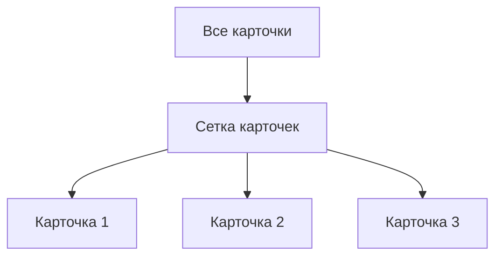
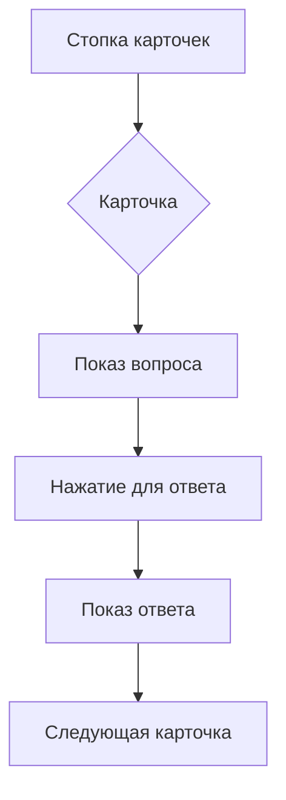

# Работа с карточками

Карточки - это основной элемент **HomeoRemedyTest**. Каждая карточка содержит вопрос, ответ и дополнительную информацию для тестирования знаний по гомеопатии.

---
## Структура карточки

### Обязательные поля

| Поле | Тип | Описание |
|------|-----|----------|
| **Тема** | Текст | Категория вопроса (можно несколько через запятую) |
| **Вопрос** | Текст | Формулировка вопроса |
| **Ответ** | Текст | Правильный ответ |
| **Сложность** | Выбор | Уровень сложности: Легкий, Средний, Сложный |

### Дополнительные поля

| Поле | Тип | Описание |
|------|-----|----------|
| **Объяснение** | Текст | Подробное объяснение ответа (опционально) |
| **Версия** | Текст | Версия теста (Test1, Test2 и т.д.) |
| **Скрыть карточку** | Флаг | Скрывает карточку из общего списка |

---
## Создание карточки

### Шаг 1: Открыть форму создания

1. Нажмите на кнопку **"+"** в правом верхнем углу
2. Или перейдите по ссылке: `http://ваш-домен/create`

### Шаг 2: Заполнить форму

#### Пример заполнения:
**Тема:** "Растения, Травма<br>
**Вопрос:** "Какое растение используется при травмах и ушибах?"<br>
**Ответ:** "Arnica montana"<br>
**Объяснение:** "Arnica - ключевое средство при травматических повреждениях..."<br>
**Сложность:** Средний<br>
**Версия:** "Test1"<br>

### Шаг 3: Сохранение

Нажмите кнопку "Сохранить вопрос". Карточка будет добавлена в базу данных и синхронизирована (в зависимости от режима хранения).

___
## Просмотр карточек

#### Режимы отображения

**1. Режим сетки (по умолчанию)**



**Особенности:**<br>
- Все карточки видны одновременно<br>
- Легкая навигация<br>
- Быстрый доступ к любой карточке<br>

**2. Режим стопки**



**Особенности:**<br>
- Карточки показываются по одной<br>
- Подходит для обучения<br>
- Скрывает ответ до нажатия<br>

#### Переключение режимов:

В фильтрах выберите *"Режим: Стопка"*<br>
Для возврата выберите *"Режим: Сетка"*<br>

___
## Детальная страница карточки

#### Доступ к детальной странице

1. В режиме сетки нажмите на карточку
2. Или перейдите по ссылке: http://ваш-домен/card/<id>

#### Информация на странице

```text
─────────── ДЕТАЛИ КАРТОЧКИ ───────────
📌 Тема: Растения, Композитные
❓ Вопрос: Какое растение используется при травмах?
✅ Ответ: Arnica montana
📖 Объяснение: Средство первой помощи...
⚡ Сложность: Средний [⚖️]
🏷️ Версия: Test1
───────────────────────────────────────
```

#### Действия на странице

1. ✏️ Редактировать - открывает форму редактирования
2. 👁️ Скрыть/Показать - скрывает карточку из общего списка
3. ← Назад к списку - возврат к общему списку

___
## Редактирование карточки

#### Как отредактировать
1. Откройте детальную страницу карточки
2. Нажмите кнопку "✏️ Редактировать"
3. Внесите изменения в форму
4. Нажмите "Сохранить изменения"

**Что можно изменить**<br>
- Все поля карточки<br>
- Нельзя изменить ID карточки<br>

**Автоматическое обновление**<br>
При редактировании карточки:<br>
- Обновляются все связанные фильтры<br>
- Синхронизируются данные (если используется гибридное хранилище)<br>
- Сохраняется история изменений<br>

___
## Скрытие карточек

Зачем скрывать карточки?

**Скрытие позволяет:**<br>
- Убрать уже изученные карточки из общего списка<br>
- Создать подборки для разных целей<br>
- Организовать обучение поэтапно<br>

#### Как скрыть/показать

**Способ 1: На детальной странице**<br>
1. Откройте карточку<br>
2. Нажмите кнопку "👁️ Скрыть" или "👁️ Показать"<br>

**Способ 2: Через меню действий**<br>
1. В режиме сетки наведите на карточку<br>
2. Нажмите иконку меню (три точки)<br>
3. Выберите "Скрыть/Показать"<br>

#### Просмотр скрытых карточек

1. В фильтрах включите "Показывать скрытые"
2. Скрытые карточки будут отображаться с пометкой "скрытая" верху карточки
3. Для постоянного отображения снова нажмите "Показать"

___
## Удаление карточек

#### Внимание!
Удаление карточки **необратимо**. Рекомендуется:<br>
- Сначала скрыть карточку<br>
- Экспортировать базу данных для резервной копии<br>
- Использовать удаление только в крайних случаях<br>

#### Как удалить
1. Откройте детальную страницу карточки
2. Нажмите кнопку **"Удалить"**
3. Подтвердите действие

#### Что происходит при удалении
1. Карточка удаляется из базы данных
2. ID не переиспользуются
3. Все фильтры обновляются
4. Данные синхронизируются (если используется облачное хранилище)

___
## Поиск карточек

#### Простой поиск

Введите текст в поле поиска в верхней части страницы:

```text
🔍 arnica
```

#### Расширенный поиск

Используйте ключевые слова:

Ключевое слово	Пример	Результат
theme:	theme:Растения	Карточки с темой "Растения"
difficulty:	difficulty:hard	Только сложные карточки
version:	version:Test1	Карточки версии "Test1"
hidden:	hidden:true	Только скрытые карточки


#### Комбинированный поиск

```text
theme:Растения difficulty:easy version:Test1
```

___
## Статистика карточек

В разделе **"Статистика"** отображается:

```text
📊 СТАТИСТИКА:
├─ Всего вопросов: 156
├─ Уникальных тем: 8
├─ Скрытых карточек: 12
├─ По теме "Растения": 45
├─ По сложности "Легкий": 67
└─ По версии "Test1": 89
```

___
## Советы по работе с карточками

**Совет 1: Используйте множественные темы**

Вместо создания отдельных карточек для пересекающихся тем:

**Хорошо:**<br>
*Тема:* "Растения, Травмы"<br>

**Плохо:**<br>
*Тема:* "Растения"<br>
(и создание второй карточки с темой "Травмы")<br>

**Совет 2: Добавляйте объяснения**<br>
Объяснение помогает:<br>
- Запомнить материал<br>
- Понять контекст<br>
- Подготовиться к экзаменам<br>

**Совет 3: Используйте версии**<br>
Версии позволяют:<br>
- Группировать карточки по тестам<br>
- Отслеживать прогресс по курсам<br>
- Организовывать материал<br>

**Совет 4: Регулярно синхронизируйте**<br>
При использовании гибридного хранилища:<br>
- Регулярно проверяйте статус синхронизации<br>
- Делайте резервные копии через экспорт<br>
- Обновляйте данные на всех устройствах<br>

___
## Проблемы и решения

#### Проблема: Карточка не сохраняется

**Причины:**<br>
- Не заполнены обязательные поля<br>
- Проблема с хранилищем данных<br>
- Ошибка сети (при облачной синхронизации)<br>

**Решение:**<br>
- Проверьте заполнение полей<br>
- Проверьте статус хранилища (системный статус)<br>
- Попробуйте сохранить локально (измените режим хранения)

#### Проблема: Карточка не отображается

**Причины:**<br>
- Карточка скрыта<br>
- Применены фильтры<br>
- Ошибка загрузки данных<br>

**Решение:**<br>
- Проверьте фильтр скрытых карточек<br>
- Сбросьте фильтры<br>
- Перезагрузите страницу<br>

#### Проблема: Не работает редактирование

**Решение:**<br>
- Проверьте права доступа<br>
- Убедитесь, что карточка не заблокирована<br>
- Попробуйте очистить кэш браузера<br>

___
## Примеры использования

#### Пример 1: Создание карточки по препарату

```yaml
Тема: "Растения, Арника"
Вопрос: "Ключевые показания для Arnica montana?"
Ответ: "Травмы, ушибы, кровоизлияния, шок"
Объяснение: "Средство первой помощи при любых травматических повреждениях..."
Сложность: "Легкий"
Версия: "Препараты_основные"
```

#### Пример 2: Карточка с дифференциальной диагностикой

```yaml
Тема: "Дифференциальная диагностика, Головная боль"
Вопрос: "Отличия Bryonia и Belladonna при головной боли?"
Ответ: "Bryonia: боль усиливается от малейшего движения. Belladonna: внезапная, пульсирующая боль"
Объяснение: "Bryonia - ухудшение от движения, Belladonna - внезапное начало, покраснение лица"
Сложность: "Сложный"
Версия: "Дифференциальный_диагноз"
```

___
## Следующие шаги

После создания карточек:

1. [Экспортируйте](import-export.md/) данные для резервного копирования
2. Настройте [синхронизацию](../storage/hybrid-storage.md) для работы на нескольких устройствах

___


